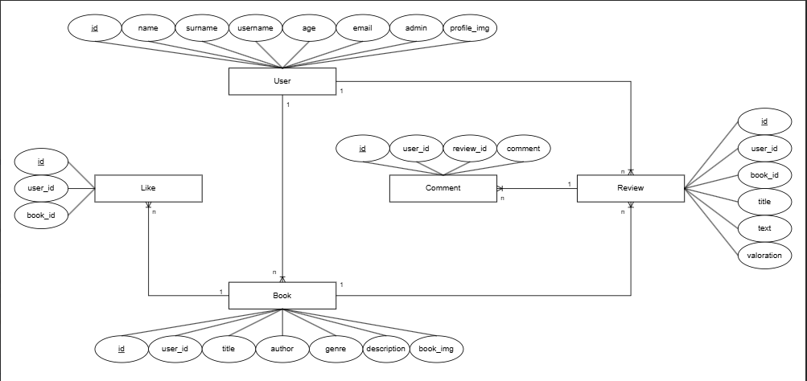

L'esquema representa una base de dades amb cinc entitats principals: **User**, **Book**, **Like**, **Review**, i **Comment**. A continuació, explico la relació entre aquestes entitats i el significat de cadascuna:

---

### 1. Entitat User
Representa els usuaris de l'aplicació. Els atributs inclouen:

- **id**: Identificador únic de l'usuari.
- **name**, **surname**, **username**, **age**, **email**: Dades personals de l'usuari.
- **admin**: Indicador de si l'usuari és administrador.
- **profile_img**: Imatge de perfil.

#### Relació:
- Un usuari pot donar **likes** a múltiples llibres.
- Un usuari pot escriure múltiples **reviews**.
- Un usuari pot afegir múltiples **comments**.

---

### 2. Entitat Book
Representa els llibres disponibles al sistema. Els atributs inclouen:

- **id**: Identificador únic del llibre.
- **user_id**: Referència a l'usuari que va afegir el llibre.
- **title**, **author**, **genre**, **description**: Informació del llibre.
- **book_img**: Imatge del llibre.

#### Relació:
- Un llibre pot rebre múltiples **likes**.
- Un llibre pot tenir múltiples **reviews** associades.

---

### 3. Entitat Like
Representa els "m'agrada" que els usuaris posen als llibres. Els atributs inclouen:

- **id**: Identificador únic del "like".
- **user_id**: Referència a l'usuari que va donar el "like".
- **book_id**: Referència al llibre que rep el "like".

#### Relació:
- Cada "like" connecta un **usuari** amb un **llibre**.

---

### 4. Entitat Review
Representa les ressenyes escrites pels usuaris sobre els llibres. Els atributs inclouen:

- **id**: Identificador únic de la ressenya.
- **user_id**: Referència a l'usuari que va escriure la ressenya.
- **book_id**: Referència al llibre al qual es refereix la ressenya.
- **title**, **text**, **valoration**: Informació de la ressenya (títol, text, valoració).

#### Relació:
- Cada ressenya està escrita per un **usuari** i associada a un **llibre**.
- Una ressenya pot tenir múltiples **comentaris**.

---

### 5. Entitat Comment
Representa els comentaris que els usuaris afegeixen a les ressenyes. Els atributs inclouen:

- **id**: Identificador únic del comentari.
- **user_id**: Referència a l'usuari que va escriure el comentari.
- **review_id**: Referència a la ressenya on s'ha escrit el comentari.
- **comment**: Text del comentari.

#### Relació:
- Cada comentari connecta un **usuari** amb una **review**.

---

### Resum de Relacions:
- Un **User** pot donar múltiples **Likes**, escriure múltiples **Reviews** i **Comments**.
- Un **Book** pot rebre múltiples **Likes** i **Reviews**.
- Una **Review** pot tenir múltiples **Comments** associats.
